# Lab7Web

## PHP Dasar

Langkah pertama yaitu instal XAMPP kemudian konfigurasi Apache, konfigurasi PHP dan konfigurasi Mysql.
Untuk menjalankan web server, buka aplikasi XAMPP kemudian buka browser ketik http://localhost atau http://127.0.0.1 jika tampil halaman utama XAMPP maka server sudah bekerja dengan baik.

Buat file baru dengan nama php_dasar.php dan tempatkan filenya di directory d:xampp/htdocs kemudian tuliskan kode berikut.

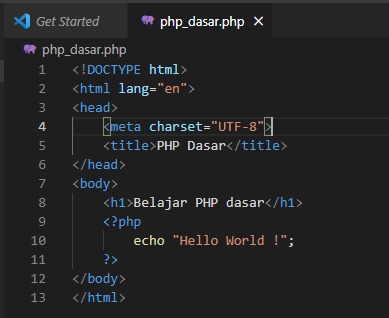

Untuk menjalankan kode diatas, buka browser kemudian tulis http://localhost/lab7_php_dasar/php_dasar.php
Ini tampilannya di browser

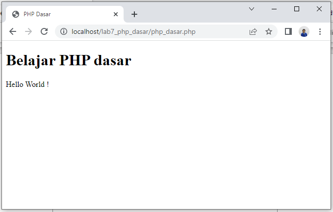

## Variable PHP

Tulis kode berikut.

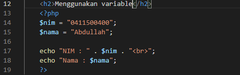

Ini tampilannya di browser.

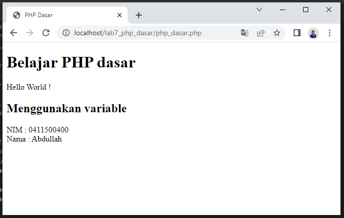

## Predefine Variable $\_GET

Tulis kode berikut.

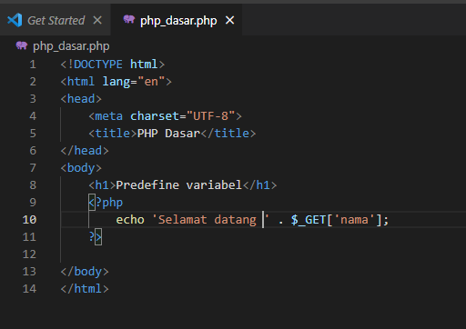

Untuk mengaksesnya gunakan URL: http://localhost/lab7_php_dasar/php_dasar.php?nama=Agung

Ini tampilannya di browser.

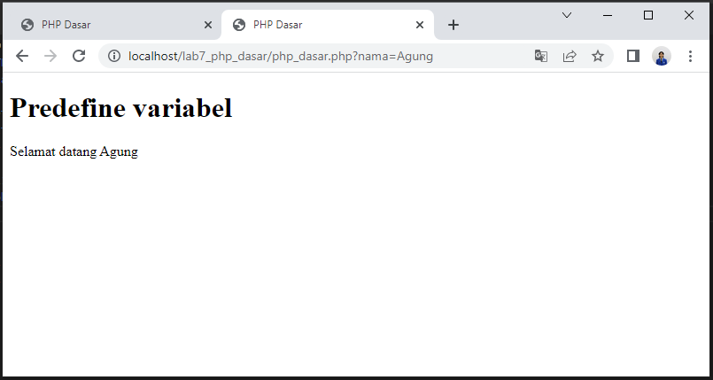

## Membuat Form Input

Tulis kode berikut dengan method="post" lalu pada syntax PHP tambahkan $\_POST untuk mengambil data dari inputan.

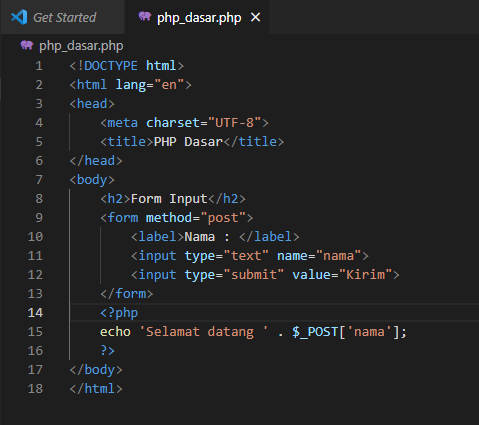

Ini tampilannya di browser.

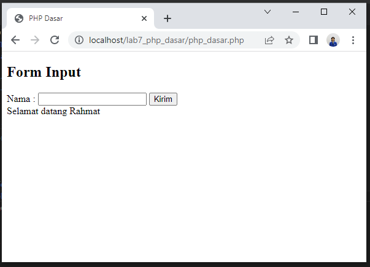

## Operator

Tulis kode berikut.

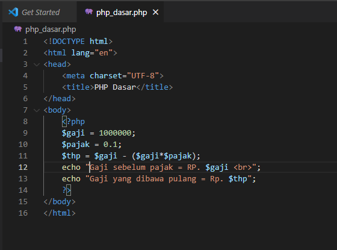

Ini tampilannya di browser.

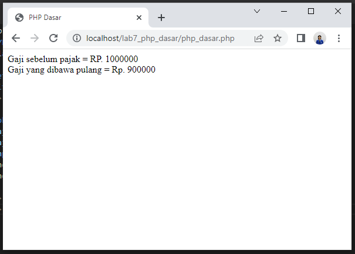

## Kondisi IF

Tulis kode berikut.

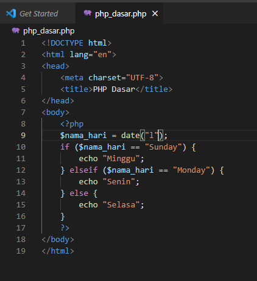

Ini tampilannya di browser.

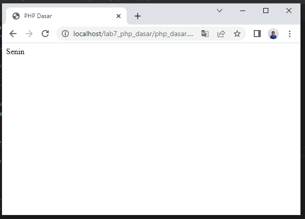

Hasilnya sesuai dengan waktu saat kita ngoding, kalau ngoding hari senin maka hasilnya hari senin dan seterusnya.

## Kondisi Switch

Tulis kode berikut.

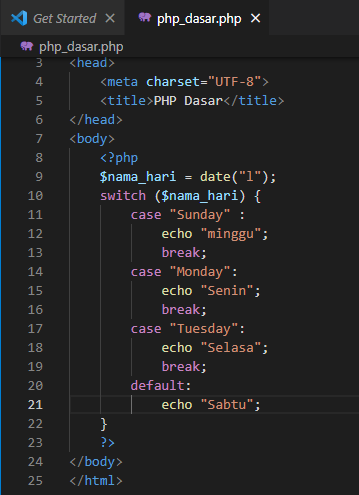

Ini tampilannya di browser.

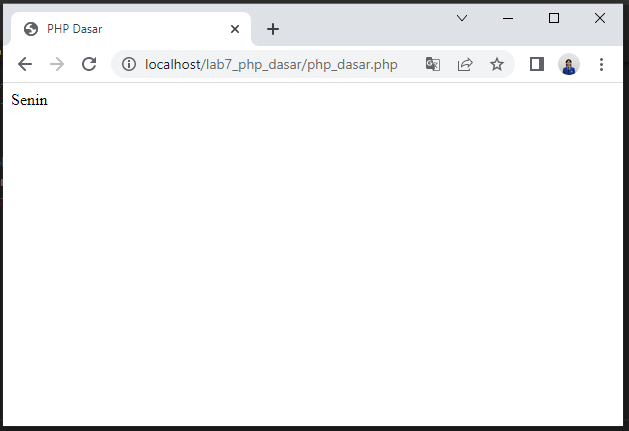

Hasilnya sesuai dengan waktu saat kita ngoding, kalau ngoding hari senin maka hasilnya hari senin dan seterusnya.

## Perulangan for

Tulis kode berikut.

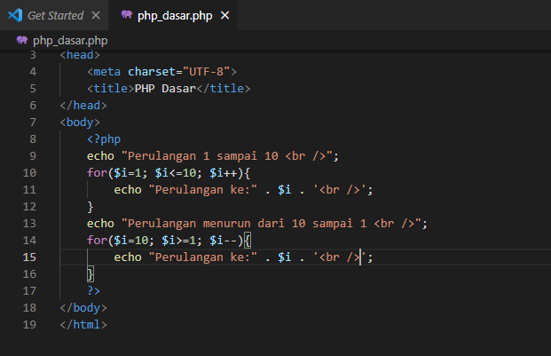

Ini hasilnya di browser.

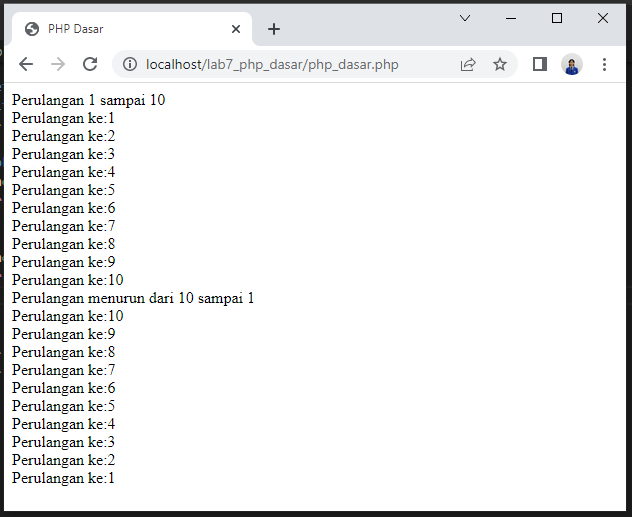

## Perulangan while

Tulis kode berikut.

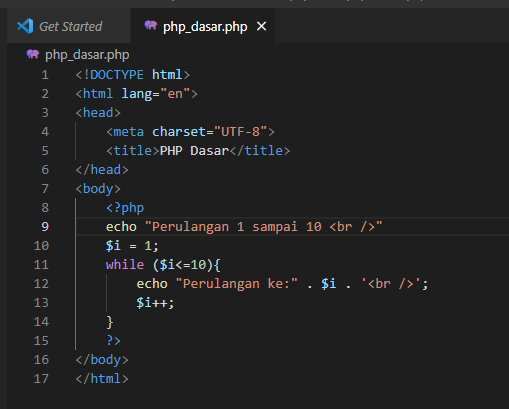

Ini hasilnya di browser.

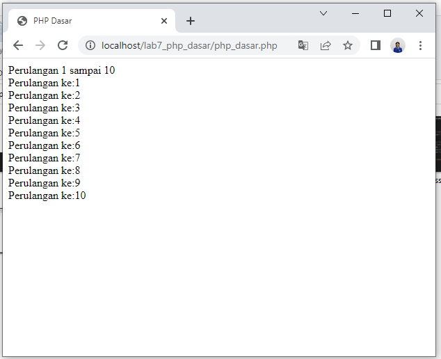

## Perulangan dowhile

Tulis kode berikut.

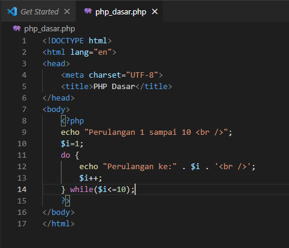

Ini hasilnya di browser.

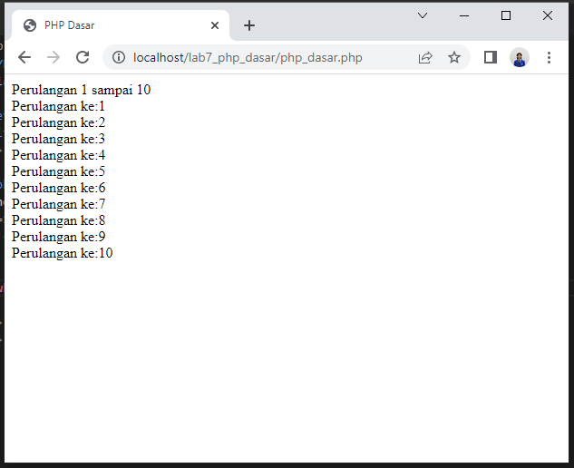

## Pertanyaan dan Tugas

Buatlah program PHP sederhana dengan menggunakan form input yang menampilkan
nama, tanggal lahir dan pekerjaan. Kemudian tampilkan outputnya dengan menghitung
umur berdasarkan inputan tanggal lahir. Dan pilihan pekerjaan dengan gaji yang
berbeda-beda sesuai pilihan pekerjaan.

### JAWABAN

Ini adalah syntax HTML nya

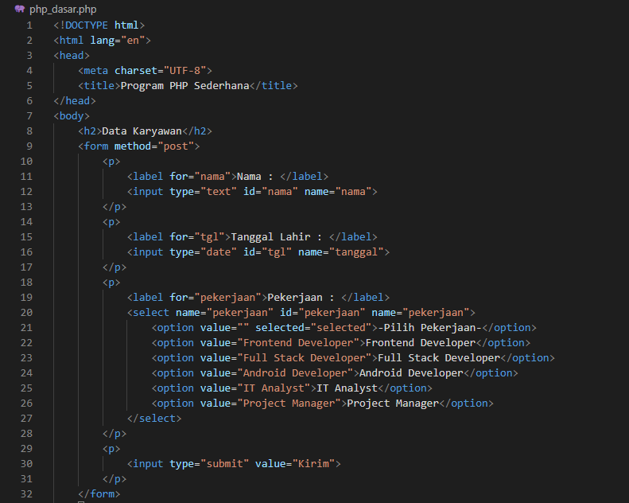

Kemudian ini adalah syntax PHP nya

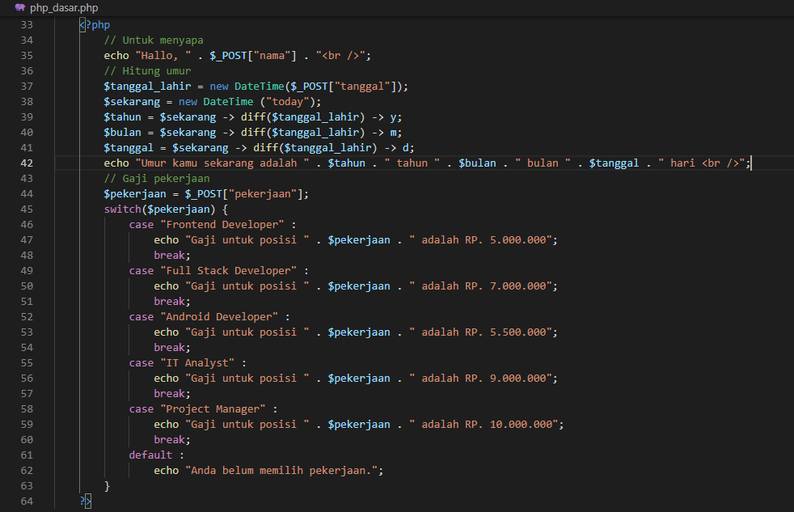

Ini hasilnya di browser.

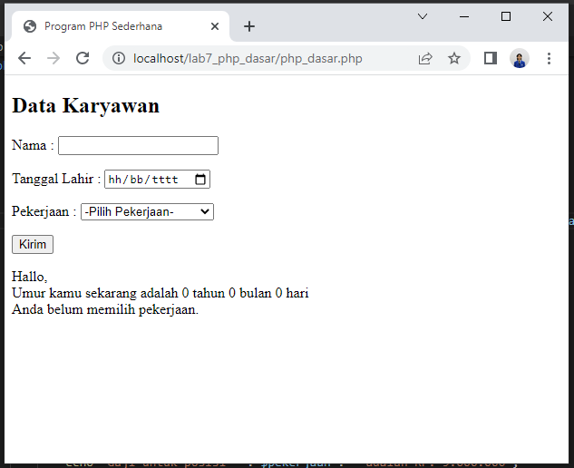

Kemudian form di isi seperti dibawah .

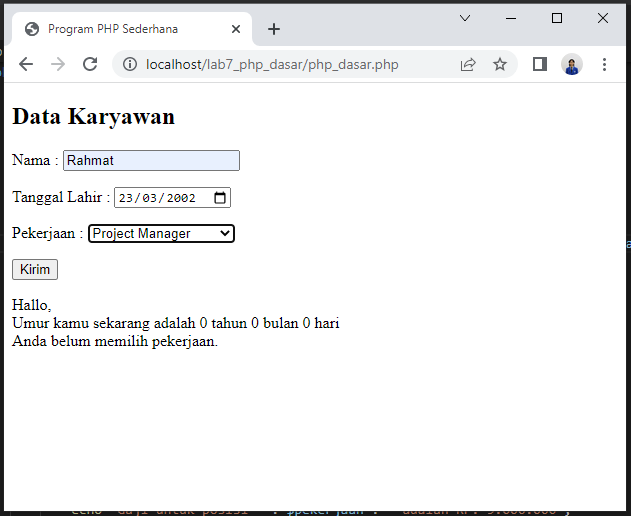

Dan ini hasilnya

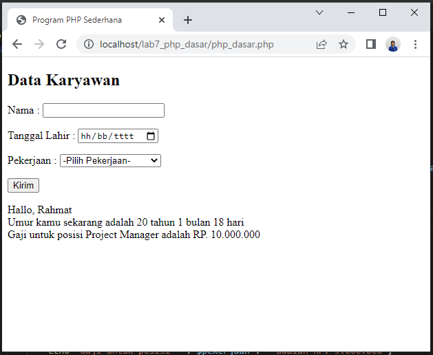
